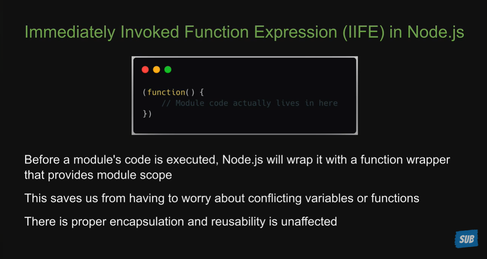

# Node.js

## Course Overview

- Terms & concepts to understand what Node.js is
- Modules (user defined)
- Built-in modules
- Node.js internals
- npm - Node Package Manager
- CLI tool
- Misc

---

## Terms & Concepts to Understand What Node.js Is

### ECMAScript Summary

- ECMA-262 is the language specification
- ECMAScript is the language that implements ECMA-262
- JavaScript is basically ECMAScript at its core but builds on top of that

### Chrome's V8 Engine Summary

- A JavaScript engine is a program that executes JavaScript code
- In 2008, Google created its own JavaScript engine called V8
- V8 is written in C++ and can be used independently or can be embedded into other C++ programs
- That allows you to write your own C++ programs which can do everything that V8 can do and more
- Your C++ program can run ECMAScript and additional features that you choose to incorporate
- For example, features that are available in C++ but not available with JavaScript

### Chrome Browser JavaScript Engine

### Node.js Summary

- Node.js is an open source, cross platform JavaScript runtime environment
- It is not a language, it is not a framework
- Capable of executing JavaScript code outside a browser
- It can execute not only the standard ECMAScript language but also new features that are made available through C++ bindings using the V8 engine
- It consists of C++ files which form the core features and JavaScript files which expose common utilities and some of the C++ features for easier consumption

### Executing JavaScript with Node

1. **Node REPL**
   - Read
   - Evaluate
   - Print
   - Loop

2. **Executing code in a JavaScript file in the command line**

### Browser vs Node.js

- In the browser, most of the time what you are doing is interacting with the DOM, or other web platform APIs like cookies. You don't have the `document`, `window` and all the other objects that are provided by the browser
- In the browser, we don't have all the nice APIs that Node.js provides through its modules. For example the file-system access functionality
- With Node.js, you control the environment
- With a browser, you are at the mercy of what the users choose

---

## Modules

- A module is an encapsulated and reusable chunk of code that has its own context
- In Node.js, each file is treated as a separate module

### Types of Modules

- **Local modules** - modules that we create in our application
- **Built-in modules** - modules that Node.js ships with out of the box
- **Third party modules** - modules written by other developers that we can use in our application

### CommonJS

- CommonJS is a standard that states how a module should be structured and shared
- Node.js adopted CommonJS when it started out and is what you will see in code bases

### Local Modules Summary

- In Node.js, each file is a module that is isolated by default
- To load a module into another file, we use the `require` functionality
- When `index.js` is executed, the code in the module is also executed
- If the file we are requiring is a JavaScript file, we can skip specifying the extension and Node.js will infer it on our behalf

### Module Scope Summary

- Each loaded module in Node.js is wrapped with an IIFE that provides private scoping of code
- IIFE allows you to repeat variable or function names without any conflicts

### Module Wrapper

- Every module in Node.js gets wrapped in an IIFE before being loaded
- IIFE helps keep top-level variables scoped to the module rather than the global object
- The IIFE that wraps every module contains 5 parameters which are pretty important for the functioning of a module

### ES Modules Summary

- ES Modules is the ECMAScript standard for modules
- It was introduced with ES2015
- Node.js 14 and above support ES Modules
- Instead of `module.exports`, we use the `export` keyword
- The export can be default or named
- We import the exported variables or functions using the `import` keyword
- If it is a default export, we can assign any name while importing
- If it is a named export, the import name must be the same

### Built-in Modules

- Modules that Node.js ships with
- Also referred to as core modules
- Import the module before you can use it

#### Focus

- `path`
- `events`
- `fs`
- `stream`
- `http`

#### Path Module

- The `path` module provides utilities for working with file and directory paths
  - `__filename`
  - `__dirname`
  - `basename()`
  - `extname()`
  - `parse()`
  - `format()`
  - `isAbsolute()`
  - `join()`
  - `resolve()`

> **`node:` protocol**
>
> - Makes it perfectly clear that the import is a Node.js builtin module
> - Makes the import identifier a valid absolute URL
> - Avoids conflicts for future Node.js built-in modules

#### Callback Pattern

- In JavaScript, functions are first class objects
- An object is a standalone entity that stores data as key-value pairs
- A class is a blueprint used to create those objects systematically
- Functions that are passed into another function as parameters, and are also called from inside that function, are called callback functions
- Functions that take another function as a parameter/argument, or return a function, are called higher order functions

#### Types of Callbacks

- Synchronous callbacks
- Asynchronous callbacks

##### Synchronous Callbacks

- A callback which is executed immediately is called a synchronous callback

##### Asynchronous Callbacks

- A callback that is often used to continue or resume code execution after an asynchronous operation has completed
- Callbacks are used to delay the execution of a function until a particular time or event has occurred
- Node.js has an asynchronous nature to prevent blocking of execution
- E.g. reading data from a file, fetching data from a database, or handling a network request

#### Events Module

- The `events` module allows us to work with events in Node.js
- An event is an action or an occurrence that has happened in our application that we can respond to
- Using the `events` module, we can dispatch our own custom events and respond to those custom events in a non-blocking manner

#### Character Sets and Encoding

#### Streams and Buffers

- A stream is a sequence of data that is being moved from one point to another over time
- E.g. a stream of data over the internet being moved from one computer to another
- E.g. a stream of data being transferred from one file to another within the same computer
- Process streams of data in chunks as they arrive instead of waiting for the entire data to be available before processing
- E.g. watching a video on YouTube
  - The data arrives in chunks and you watch in chunks while the rest of the data arrives over time
- E.g. transferring file contents from fileA to fileB
  - The contents arrive in chunks and you transfer in chunks while the remaining contents arrive over time
- Prevents unnecessary data download and memory usage

#### Asynchronous JavaScript

- **JavaScript in its basic form is a <u>Synchronous</u>, <u>Blocking</u>, <u>Single-Threaded</u> language.**
- **<u>Synchronous</u>**: If we have two functions which log messages to the console, code executes top down, with only one line executing at any given time.
- **<u>Blocking</u>**: No matter how long a previous process takes, the subsequent processes won't kick off until the former is completed. If a web app runs in a browser and it executes an intensive chunk of code without returning control to the browser, the browser can appear to be frozen.
- **<u>Single threaded</u>**: A thread is simply a unit of a process that JavaScript programs use to run tasks. Each thread can only do one task at a time. JavaScript has just the one thread, called the main thread, for executing any code.

**<u>NB:</u>**
- Just JavaScript is not enough - we need new pieces which are outside of JavaScript to help us write asynchronous code.
- For front end, this is where web browsers come into play. For back end, this is where Node.js comes into play.
- Web browsers and Node.js define functions and APIs that allow us to register functions that should not be executed synchronously, and should instead be invoked asynchronously when some kind of event occurs.
- For example, that could be the passage of time (`setTimeout` or `setInterval`), the user's interaction with the mouse (`addEventListener`), data being read from the file system, or the arrival of data over the network (callbacks, promises, async/await).
- You can let your code do several things at the same time without stopping or blocking your main thread.

#### fs Module

- The file system (`fs`) module allows you to work with the file system on your computer
- It supports reading, writing, updating, deleting, and watching files and directories
- Most methods are available in three flavors:
  - **Synchronous** - blocks the main thread until the operation completes, e.g. `readFileSync()`
  - **Callback-based (asynchronous)** - non-blocking, takes a callback that runs once the operation completes, e.g. `readFile()`
  - **Promise-based** - non-blocking, returned via `fs/promises`, works well with `async`/`await`
- Prefer the asynchronous or promise-based APIs in production code so file I/O doesn't block the single main thread

##### Common `fs` Methods

- `readFile()` / `writeFile()` / `appendFile()` - read from, write to, or append to a file
- `readdir()` - read the contents of a directory
- `mkdir()` / `rmdir()` - create or remove a directory
- `unlink()` - delete a file
- `stat()` - get information about a file or directory (size, type, timestamps, etc.)
- `rename()` - rename or move a file
- `existsSync()` - synchronously check whether a path exists
- `createReadStream()` / `createWriteStream()` - read from or write to a file as a stream, useful for large files
